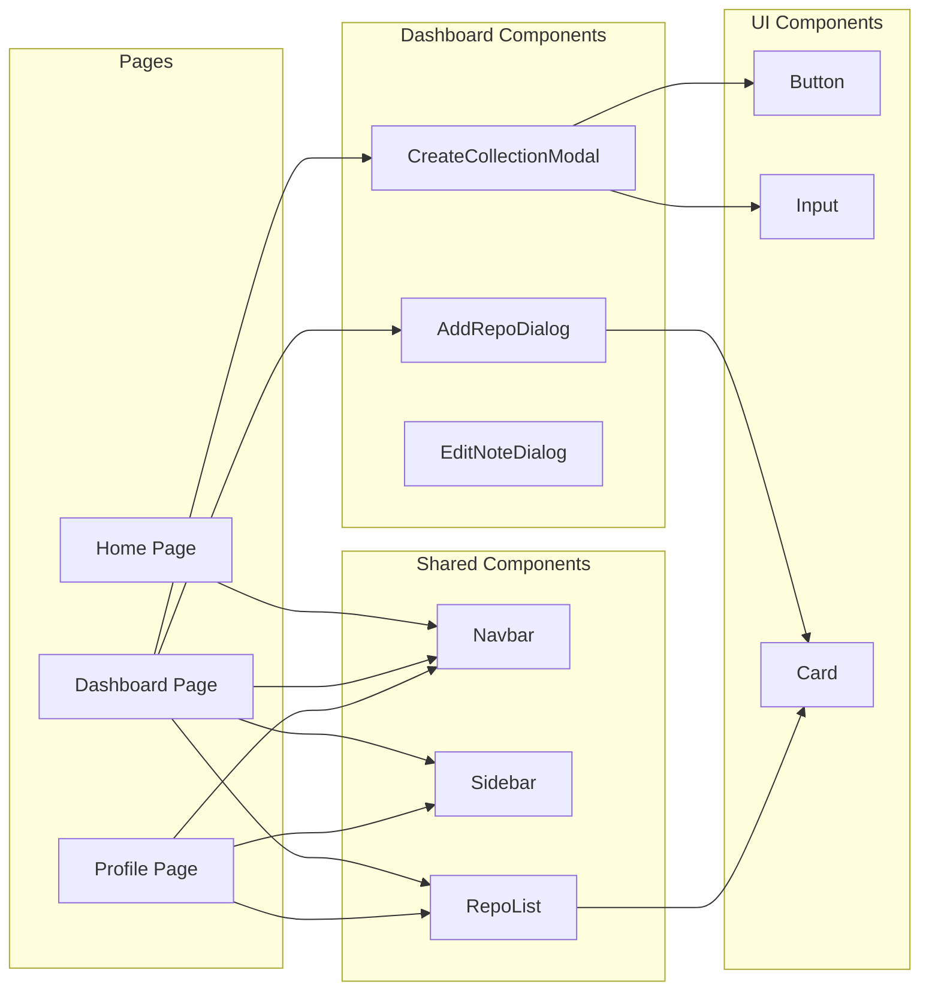
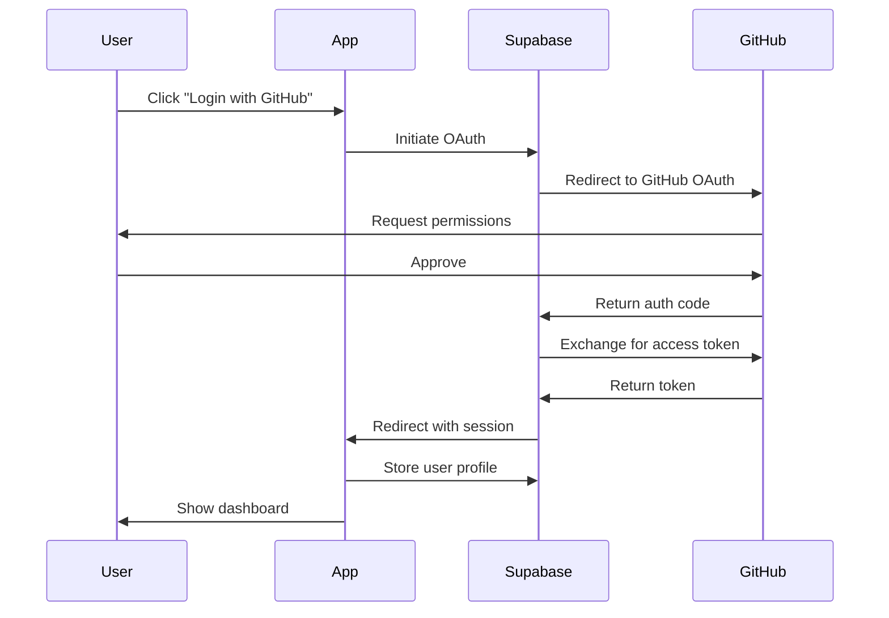

# Architecture Overview

This document provides a high-level overview of Facet's system architecture, component relationships, and design decisions.

## System Architecture

```mermaid
graph TB
    subgraph "Client Layer"
        Browser[Web Browser]
        UI[Next.js UI Components]
    end

    subgraph "Application Layer"
        NextJS[Next.js 16 App Router]
        ServerComponents[Server Components]
        ClientComponents[Client Components]
        API[API Routes]
    end

    subgraph "Data Layer"
        Supabase[(Supabase PostgreSQL)]
        SupabaseAuth[Supabase Auth]
        GitHub[GitHub REST API]
    end

    Browser --> UI
    UI --> NextJS
    NextJS --> ServerComponents
    NextJS --> ClientComponents
    NextJS --> API

    ServerComponents --> Supabase
    ServerComponents --> GitHub
    ClientComponents --> API
    API --> Supabase
    API --> SupabaseAuth

    SupabaseAuth --> GitHub

    style NextJS fill:#0070f3
    style Supabase fill:#3ecf8e
    style GitHub fill:#333
```

## Component Architecture

### Frontend Components

## Data Flow Layers

### 1. Presentation Layer

- **Next.js Pages**: Server-rendered and client-side pages
- **React Components**: Reusable UI components
- **Tailwind CSS**: Utility-first styling

### 2. Business Logic Layer

- **Server Queries**: Data fetching on the server
- **Client Queries**: Data fetching on the client
- **Mutations**: Data modification operations
- **GitHub API Client**: External API integration

### 3. Data Persistence Layer

- **Supabase Database**: PostgreSQL database
- **Supabase Auth**: Authentication and session management
- **GitHub OAuth**: Third-party authentication

## Key Design Decisions

### 1. Hybrid Data Strategy

Facet uses a **hybrid approach** to data fetching:

- **Registered Users**: Data from Supabase (curated collections) + GitHub API (repo metadata)
- **Non-Registered Users**: Data entirely from GitHub API

This allows Facet to work as a "GitHub profile viewer" even for users who haven't signed up.

### 2. Server Components First

We leverage Next.js 16's Server Components for:

- Initial page loads (faster, SEO-friendly)
- Data fetching without client-side waterfalls
- Reduced JavaScript bundle size

Client Components are used only when necessary (forms, drag-and-drop, modals).

### 3. Optimistic Updates

For drag-and-drop reordering:

1. Update UI immediately (optimistic)
2. Send mutation to database
3. Revert on error (if needed)

This provides instant feedback while maintaining data consistency.

### 4. Virtual Collections

The "All Public Repos" collection is **virtual**—it doesn't exist in the database but is dynamically generated by:

1. Fetching total public repos from GitHub
2. Fetching categorized repos from Supabase
3. Filtering GitHub repos to exclude categorized ones

## Authentication Flow

## Database Design Principles

### 1. Minimal Schema

Only store what's necessary:

- User profiles (minimal metadata)
- Collections (user-created groups)
- Collection repos (references to GitHub repos)

### 2. GitHub as Source of Truth

Never duplicate GitHub data (stars, languages, descriptions). Always fetch fresh from GitHub API.

### 3. Position-Based Ordering

Use integer `position` fields for drag-and-drop ordering instead of complex linked lists.

## Performance Optimizations

### 1. Pagination

- Collections: Load all (typically < 20)
- Repositories: Load 10-100 per page

### 2. Caching Strategy

- Server Components: Automatic Next.js caching
- Client Components: React Query (future enhancement)
- GitHub API: Consider rate limits (60 req/hour unauthenticated)

### 3. Bundle Optimization

- Code splitting via Next.js dynamic imports
- Tree shaking for unused code
- Minimal dependencies

## Security Considerations

### 1. Row-Level Security (RLS)

Supabase RLS policies ensure:

- Users can only modify their own collections
- Public collections are readable by anyone
- Private collections are hidden

### 2. API Rate Limiting

- GitHub API has rate limits (5000 req/hour authenticated)
- Implement caching for frequently accessed data

### 3. Input Validation

- Sanitize user inputs (collection names, notes)
- Validate GitHub usernames before API calls

## Scalability

### Current Scale

- Designed for: 1-10K users
- Database: Supabase free tier (500MB, 2GB bandwidth)
- Hosting: Vercel free tier

### Future Enhancements

- Redis caching layer
- CDN for static assets
- Database read replicas
- Background job queue for GitHub syncing

## Technology Choices

| Technology         | Why We Chose It                             |
| ------------------ | ------------------------------------------- |
| **Next.js 16**     | Server Components, App Router, excellent DX |
| **TypeScript**     | Type safety, better IDE support             |
| **Tailwind CSS 4** | Rapid UI development, small bundle          |
| **Supabase**       | PostgreSQL + Auth + Realtime in one         |
| **@dnd-kit**       | Accessible, performant drag-and-drop        |
| **Vercel**         | Zero-config deployment, edge functions      |

## Deployment Architecture

```mermaid
graph LR
    subgraph "Vercel Edge Network"
        Edge[Edge Functions]
        CDN[Static Assets CDN]
    end

    subgraph "Vercel Serverless"
        SSR[Server-Side Rendering]
        API[API Routes]
    end

    subgraph "Supabase Cloud"
        DB[(PostgreSQL)]
        Auth[Auth Service]
    end

    User[Users] --> Edge
    Edge --> SSR
    Edge --> CDN
    SSR --> DB
    SSR --> Auth
    API --> DB

    style Vercel fill:#000
    style Supabase fill:#3ecf8e
```

## Future Architecture Considerations

### 1. Real-time Collaboration

- WebSocket connections via Supabase Realtime
- Live updates when collections change

### 2. Analytics

- Track profile views
- Monitor popular collections
- User engagement metrics

### 3. Search

- Full-text search across collections
- Repository search within Facet

### 4. Export/Import

- Export collections as JSON
- Import from other portfolio tools
