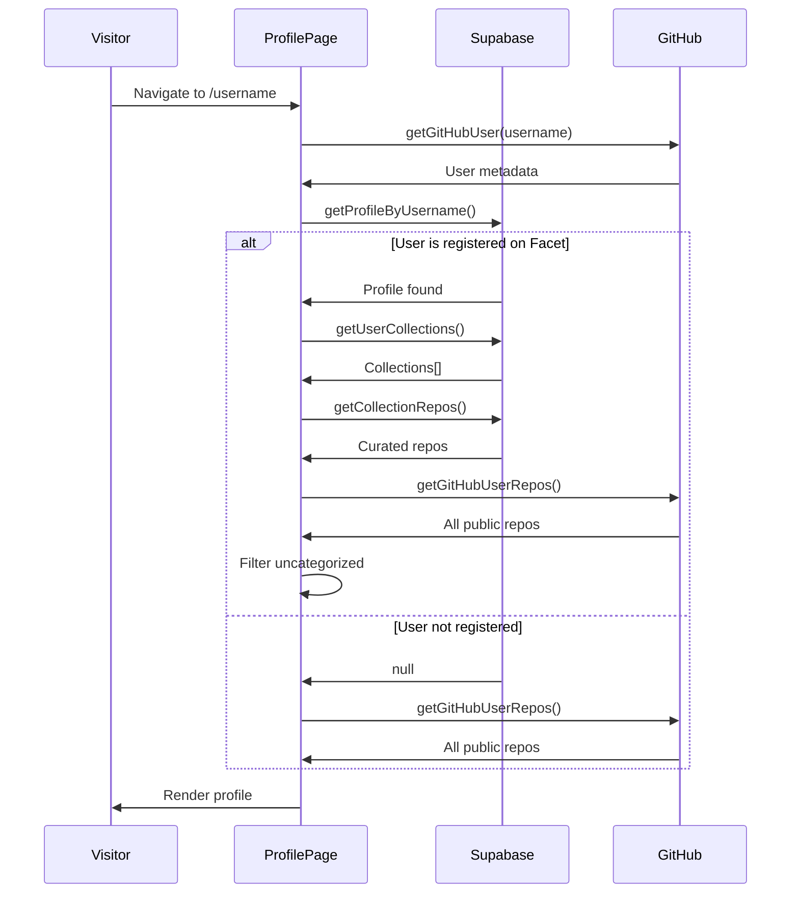

# Data Flow Documentation

This document explains how data flows through the Facet application, from user actions to database updates and UI rendering.

## Overview

Facet uses a **hybrid data architecture** that combines:

1. **Supabase Database** - User profiles, collections, and repository references
2. **GitHub REST API** - Live repository metadata (stars, languages, descriptions)

## Core Data Flows

### 1. User Authentication Flow


**Key Points:**

- OAuth handled entirely by Supabase
- User metadata synced on every login
- Session stored in HTTP-only cookies

### 2. Dashboard Data Loading


**Data Structure:**

```typescript
// Collections from Supabase
{
  id: string;
  user_id: string;
  title: string;
  description: string;
  position: number;
  count: number; // computed
}

// Repos from Supabase (references only)
{
  id: string;
  collection_id: string;
  full_name: string; // "owner/repo"
  note: string;
  position: number;
}
```

### 3. Public Profile Data Loading



**Hybrid Data Strategy:**

- Always fetch GitHub data for freshness
- Overlay Facet data (collections, notes) if user is registered
- Compute "Other Repos" by filtering

### 4. Creating a Collection


**Mutation:**

```typescript
createCollection(supabase, title, description) {
  return supabase
    .from("collections")
    .insert([{ user_id, title, description, is_public: true }])
    .select()
    .single()
}
```

### 5. Adding a Repository to Collection


**Optimistic UI:**

- Mark repo as "Added" immediately
- Disable button to prevent duplicates
- Revert on error

### 6. Drag-and-Drop Reordering


**Batch Update:**

```typescript
reorderCollections(supabase, updates) {
  // updates = [{ id, user_id, title, ..., position: newIndex }]
  return supabase
    .from("collections")
    .upsert(updates, { onConflict: 'id' })
}
```

### 7. Search Flow (Navbar)


## Data Caching Strategy

### Server Components (Next.js)

```typescript
// Automatic caching with revalidation
export const revalidate = 3600; // 1 hour

async function getProfile(username: string) {
  // Cached by Next.js
  const profile = await getProfileByUsername(username);
  return profile;
}
```

### Client Components (React State)

```typescript
// Manual state management
const [collections, setCollections] = useState([]);

useEffect(() => {
  fetchCollections().then(setCollections);
}, []);
```

### GitHub API

- **Rate Limits**: 60 req/hour (unauthenticated), 5000 req/hour (authenticated)
- **Strategy**: Fetch on-demand, no persistent caching yet
- **Future**: Redis cache layer for popular profiles

## State Management

### Dashboard State

```typescript
// DashboardPage.tsx
const [collections, setCollections] = useState([]);
const [repos, setRepos] = useState([]);
const [user, setUser] = useState(null);
const [activeCollectionId, setActiveCollectionId] = useState(null);
```

**State Updates:**

1. Initial load: `useEffect` on mount
2. Collection change: `useEffect` on `activeCollectionId`
3. Mutations: Optimistic updates + refetch

### Profile Page State

```typescript
// [username]/page.tsx (Server Component)
// No client state - all data fetched on server
const profile = await getProfileByUsername(username);
const collections = await getUserCollections(profile.id);
const repos = await getCollectionRepos(collectionId);
```

## Error Handling

### Network Errors

```typescript
try {
  const repos = await getGitHubUserRepos(username);
} catch (error) {
  console.error(error);
  setRepos([]); // Fallback to empty
}
```

### Database Errors

```typescript
try {
  await createCollection(supabase, title, description);
} catch (error) {
  alert("Failed to create collection");
  // State remains unchanged
}
```

### GitHub API Errors

- **404 Not Found**: User doesn't exist → show 404 page
- **403 Rate Limit**: Too many requests → show error message
- **500 Server Error**: GitHub down → show fallback UI

## Data Consistency

### Problem: Stale Data

When a user updates a collection on one device, another device might show old data.

**Current Solution:**

- Refresh on navigation
- Manual refresh (reload page)

**Future Solution:**

- Supabase Realtime subscriptions
- Automatic UI updates across devices

### Problem: Race Conditions

Multiple rapid updates could conflict.

**Current Solution:**

- Optimistic updates
- Last-write-wins on server

**Future Solution:**

- Debounce mutations
- Conflict resolution UI

## Performance Considerations

### Database Queries

```sql
-- Efficient: Uses index on user_id
SELECT * FROM collections WHERE user_id = $1 ORDER BY position

-- Efficient: Uses index on collection_id
SELECT * FROM collection_repos WHERE collection_id = $1 ORDER BY position
```

### GitHub API Calls

```typescript
// Parallel fetching
const [user, repos] = await Promise.all([
  getGitHubUser(username),
  getGitHubUserRepos(username),
]);
```

### Bundle Size

- Server Components: 0 KB JavaScript to client
- Client Components: Only interactive parts
- Total JS: ~150 KB (gzipped)

## Data Flow Summary

| Action            | Data Source             | Update Strategy           |
| ----------------- | ----------------------- | ------------------------- |
| Login             | GitHub OAuth → Supabase | Session cookies           |
| Load Dashboard    | Supabase                | Fetch on mount            |
| Load Profile      | Supabase + GitHub       | Server-side fetch         |
| Create Collection | Supabase                | Mutation + refetch        |
| Add Repo          | Supabase                | Optimistic + refetch      |
| Reorder           | Supabase                | Optimistic + batch update |
| Search User       | GitHub API              | Direct navigation         |
