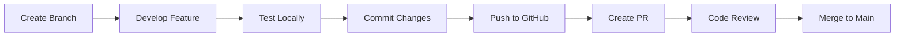

# Development Guide

Welcome to the Facet development guide! This document will help you set up your development environment, understand our workflows, and contribute effectively.

## Getting Started

### Prerequisites

- **Node.js** 18+ and npm
- **Git** for version control
- **Supabase Account** (free tier works)
- **GitHub Account** for OAuth testing
- **Code Editor** (VS Code recommended)

### Initial Setup

1. **Clone and Install**

   ```bash
   git clone https://github.com/ShowcaseVault/Facet.git
   cd facet
   npm install
   ```

2. **Environment Variables**

   Create `.env.local`:

   ```env
   NEXT_PUBLIC_SUPABASE_URL=https://your-project.supabase.co
   NEXT_PUBLIC_SUPABASE_ANON_KEY=your-anon-key
   ```

3. **Database Setup**

   Run the SQL from `docs/models.sql` in your Supabase SQL editor.

4. **GitHub OAuth**
   - Create a GitHub OAuth App
   - Set callback URL: `http://localhost:3000/auth/callback`
   - Add credentials to Supabase Auth settings

5. **Start Development**
   ```bash
   npm run dev
   ```

## Project Structure

```
facet/
├── app/                      # Next.js App Router
│   ├── [username]/          # Dynamic route for profiles
│   │   └── page.tsx         # Profile page (Server Component)
│   ├── dashboard/           # Protected dashboard
│   │   ├── layout.tsx       # Auth guard
│   │   └── page.tsx         # Dashboard (Client Component)
│   ├── auth/                # Auth callbacks
│   │   └── callback/
│   │       └── route.ts     # OAuth callback handler
│   ├── layout.tsx           # Root layout
│   ├── page.tsx             # Home page
│   ├── loading.tsx          # Global loading UI
│   └── globals.css          # Global styles
│
├── components/
│   ├── dashboard/           # Dashboard-specific
│   │   ├── CreateCollectionModal.tsx
│   │   ├── AddRepoDialog.tsx
│   │   └── EditNoteDialog.tsx
│   ├── shared/              # Reusable across pages
│   │   ├── Navbar.tsx       # Top navigation
│   │   ├── Sidebar.tsx      # Collections sidebar
│   │   └── RepoList.tsx     # Repository cards
│   └── ui/                  # Base UI primitives
│       ├── Button.tsx
│       ├── Input.tsx
│       └── Card.tsx
│
├── lib/
│   ├── github/              # GitHub API client
│   │   └── api.ts           # API functions
│   ├── supabase/            # Supabase integration
│   │   ├── client.ts        # Client-side client
│   │   ├── server.ts        # Server-side client
│   │   ├── queries.ts       # Read operations
│   │   ├── mutations.ts     # Write operations
│   │   └── server-queries.ts # Server wrappers
│   └── utils.ts             # Utility functions
│
├── docs/                    # Documentation
│   ├── architecture.md
│   ├── data-flow.md
│   ├── database_schema.md
│   └── models.sql
│
└── public/                  # Static assets
    └── logo.png
```

## Development Workflow

### Feature Development



### Branch Naming

- `feature/add-collection-sharing` - New features
- `fix/sidebar-drag-bug` - Bug fixes
- `docs/update-readme` - Documentation
- `refactor/simplify-queries` - Code refactoring

### Commit Messages

Follow conventional commits:

```
feat: add collection sharing feature
fix: resolve drag-and-drop position bug
docs: update architecture diagrams
refactor: simplify database queries
chore: update dependencies
```

## Code Style

### TypeScript

```typescript
// ✅ Good: Explicit types
interface Collection {
  id: string;
  title: string;
  description: string | null;
}

// ❌ Bad: Implicit any
const collections = [];
```

### React Components

```typescript
// ✅ Good: Functional components with TypeScript
interface ButtonProps {
  children: React.ReactNode
  onClick?: () => void
  variant?: "default" | "ghost"
}

export function Button({ children, onClick, variant = "default" }: ButtonProps) {
  return <button onClick={onClick}>{children}</button>
}

// ❌ Bad: No types
export function Button({ children, onClick }) {
  return <button onClick={onClick}>{children}</button>
}
```

### File Naming

- Components: `PascalCase.tsx` (e.g., `Sidebar.tsx`)
- Utilities: `camelCase.ts` (e.g., `utils.ts`)
- Pages: `page.tsx`, `layout.tsx` (Next.js convention)

## Testing Strategy

### Manual Testing Checklist

**Authentication:**

- [ ] Login with GitHub works
- [ ] Logout clears session
- [ ] Protected routes redirect to login

**Dashboard:**

- [ ] Create collection
- [ ] Edit collection description
- [ ] Delete collection
- [ ] Add repository to collection
- [ ] Remove repository from collection
- [ ] Reorder collections (drag-and-drop)
- [ ] Reorder repositories (drag-and-drop)
- [ ] Add/edit repository notes

**Public Profile:**

- [ ] View registered user profile
- [ ] View non-registered GitHub user
- [ ] Switch between collections
- [ ] "Other Repos" shows uncategorized repos
- [ ] Pagination works

**Search:**

- [ ] Search for users in navbar
- [ ] Navigate to searched profile

### Future: Automated Tests

```typescript
// Example: Unit test for utils
import { cn } from "./utils";

test("cn merges class names", () => {
  expect(cn("foo", "bar")).toBe("foo bar");
  expect(cn("foo", false && "bar")).toBe("foo");
});
```

## Common Development Tasks

### Adding a New Component

1. Create file in appropriate directory:

   ```typescript
   // components/ui/Badge.tsx
   interface BadgeProps {
     children: React.ReactNode
   }

   export function Badge({ children }: BadgeProps) {
     return <span className="badge">{children}</span>
   }
   ```

2. Export from index (if needed):

   ```typescript
   // components/ui/index.ts
   export { Badge } from "./Badge";
   export { Button } from "./Button";
   ```

3. Use in your page:
   ```typescript
   import { Badge } from "@/components/ui/Badge";
   ```

### Adding a New Database Table

1. Write migration SQL:

   ```sql
   create table tags (
     id uuid primary key default gen_random_uuid(),
     name text not null unique,
     created_at timestamp with time zone default now()
   );
   ```

2. Run in Supabase SQL editor

3. Add TypeScript types:

   ```typescript
   // lib/supabase/queries.ts
   export type Tag = {
     id: string;
     name: string;
     created_at: string;
   };
   ```

4. Create query functions:
   ```typescript
   export async function getTags(supabase: SupabaseClient) {
     const { data, error } = await supabase.from("tags").select("*");

     if (error) throw error;
     return data as Tag[];
   }
   ```

### Adding a New API Route

```typescript
// app/api/collections/route.ts
import { createClient } from "@/lib/supabase/server";
import { NextResponse } from "next/server";

export async function GET() {
  const supabase = await createClient();
  const {
    data: { user },
  } = await supabase.auth.getUser();

  if (!user) {
    return NextResponse.json({ error: "Unauthorized" }, { status: 401 });
  }

  const { data } = await supabase
    .from("collections")
    .select("*")
    .eq("user_id", user.id);

  return NextResponse.json(data);
}
```

## Debugging

### Common Issues

**Issue: "Supabase client not initialized"**

- Check `.env.local` has correct values
- Restart dev server after changing env vars

**Issue: "GitHub OAuth redirect fails"**

- Verify callback URL in GitHub OAuth app settings
- Check Supabase Auth provider configuration

**Issue: "Database query fails"**

- Check RLS policies in Supabase
- Verify user is authenticated
- Check SQL syntax in queries

### Debugging Tools

**Next.js DevTools:**

```bash
# Enable verbose logging
DEBUG=* npm run dev
```

**Supabase Logs:**

- Go to Supabase Dashboard → Logs
- Filter by table or function

**React DevTools:**

- Install browser extension
- Inspect component state and props

## Performance Optimization

### Image Optimization

```typescript
// Use Next.js Image component
import Image from 'next/image'

<Image
  src="/logo.png"
  alt="Logo"
  width={32}
  height={32}
  priority // For above-the-fold images
/>
```

### Code Splitting

```typescript
// Dynamic imports for heavy components
import dynamic from 'next/dynamic'

const HeavyChart = dynamic(() => import('./HeavyChart'), {
  loading: () => <p>Loading chart...</p>,
  ssr: false // Client-side only
})
```

### Database Optimization

```sql
-- Add indexes for frequently queried columns
CREATE INDEX idx_collections_user_id ON collections(user_id);
CREATE INDEX idx_collection_repos_collection_id ON collection_repos(collection_id);
```

## Deployment

### Vercel Deployment

1. **Connect GitHub repo** to Vercel
2. **Set environment variables** in Vercel dashboard
3. **Deploy** - automatic on push to main

### Environment Variables

Production `.env.production`:

```env
NEXT_PUBLIC_SUPABASE_URL=https://prod-project.supabase.co
NEXT_PUBLIC_SUPABASE_ANON_KEY=prod-anon-key
```

## Contributing Guidelines

### Pull Request Process

1. **Fork** the repository
2. **Create** a feature branch
3. **Make** your changes
4. **Test** thoroughly
5. **Commit** with clear messages
6. **Push** to your fork
7. **Create** a pull request

### PR Template

```markdown
## Description

Brief description of changes

## Type of Change

- [ ] Bug fix
- [ ] New feature
- [ ] Breaking change
- [ ] Documentation update

## Testing

- [ ] Tested locally
- [ ] Checked for TypeScript errors
- [ ] Verified UI on mobile

## Screenshots

(if applicable)
```

### Code Review Checklist

- [ ] Code follows project style
- [ ] TypeScript types are correct
- [ ] No console.log statements
- [ ] Error handling is present
- [ ] UI is responsive
- [ ] Accessibility considered

## Resources

- [Next.js Documentation](https://nextjs.org/docs)
- [Supabase Documentation](https://supabase.com/docs)
- [Tailwind CSS Documentation](https://tailwindcss.com/docs)
- [GitHub REST API](https://docs.github.com/en/rest)
- [@dnd-kit Documentation](https://docs.dndkit.com/)

## Getting Help

- **Issues**: [GitHub Issues](https://github.com/yourusername/facet/issues)
- **Discussions**: [GitHub Discussions](https://github.com/yourusername/facet/discussions)
- **Discord**: [Join our community](https://discord.gg/facet) _(if applicable)_

## License

By contributing, you agree that your contributions will be licensed under the MIT License.
